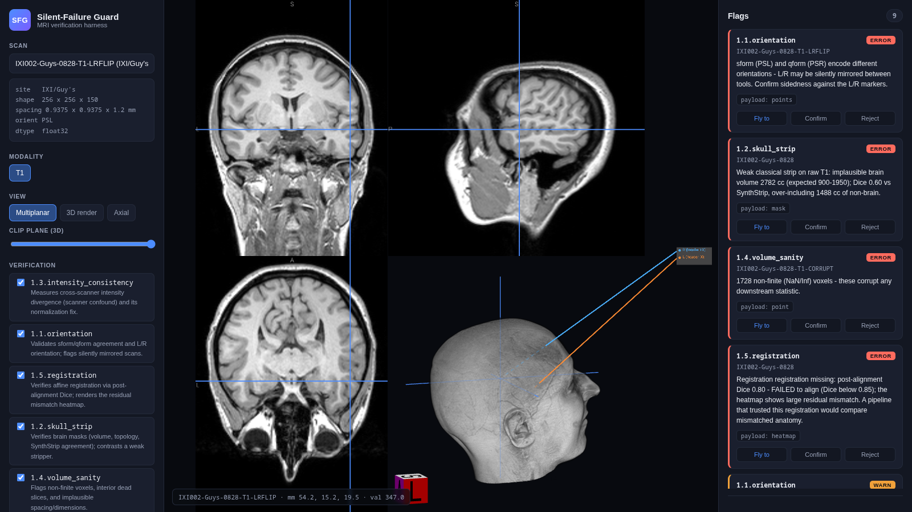
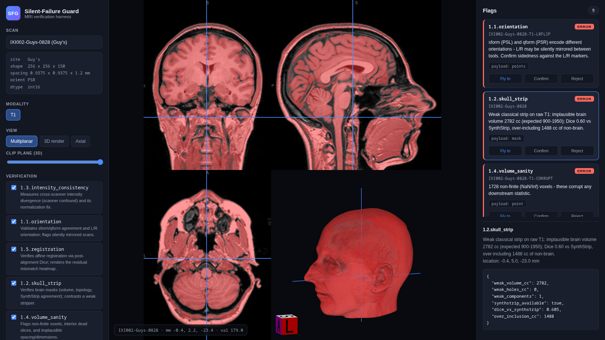
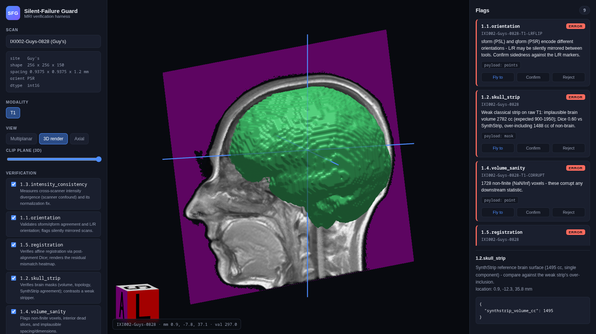
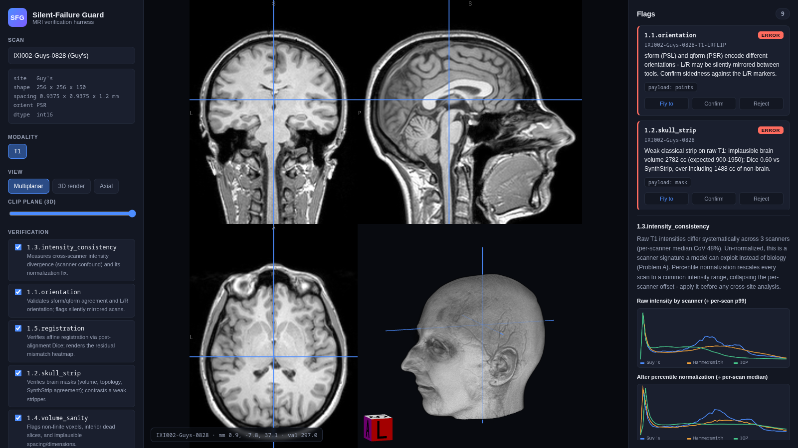
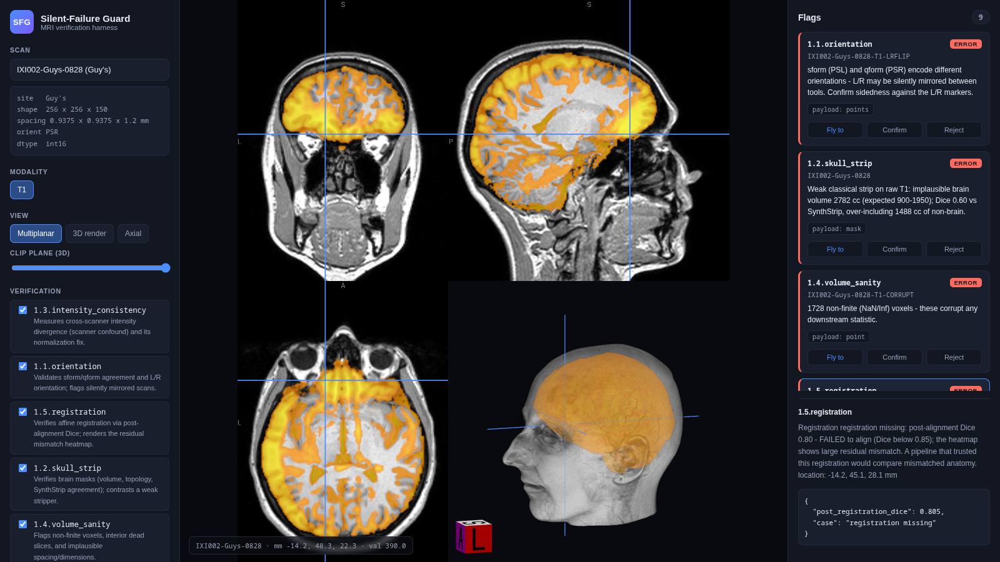
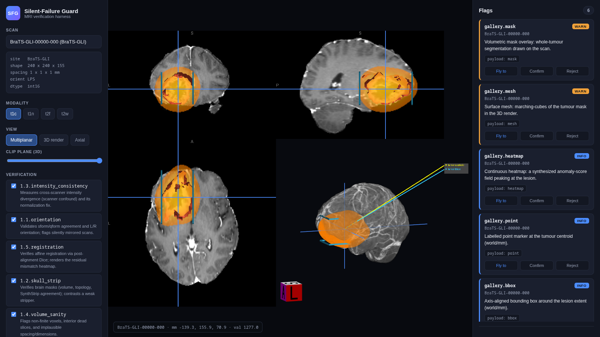

# Silent-Failure Guard

A verification harness and interactive 3D annotation viewer for brain-MRI research. It
catches the **silent failures** that survive a normal QC spot-check - the ones that do not
crash a pipeline, they just quietly corrupt the science: a left/right-mirrored scan, a
skull-strip that leaves the skull on, scanner intensity that a model learns instead of
biology, dropped slices, a registration that never converged.

Every problem the harness finds is rendered as an annotation in an interactive 3D viewer and
the camera is flown to it, so a human can adjudicate each one in seconds.



## What it catches (this release)

A deterministic verifier runs a suite of checks over a cohort, emits **located, severity-ranked
flags**, and drives the viewer to each one. Checks stay quiet on clean data and fire on real or
induced failures.

| Check | Silent failure | How it is caught |
|-------|----------------|------------------|
| **1.1 Orientation / LR-flip** | A scan whose `sform` and `qform` encode opposite left/right - half a pipeline sees the brain mirrored | Compares the two transforms, flags disagreement, drops L/R laterality markers in 3D |
| **1.2 Skull-strip** (flagship) | A brain mask that keeps the skull, or eats into the brain | Verifies mask volume / topology and contrasts a weak classical stripper against **SynthStrip** |
| **1.3 Intensity consistency** | Raw intensities that differ by scanner - a scanner signature a model exploits instead of biology | Measures cross-scanner divergence and shows the per-scanner distributions + the normalization fix |
| **1.4 Volume sanity** | NaN/Inf voxels, dropped interior slices, implausible spacing | A fast linter over the raw grid |
| **1.5 Registration** (stretch) | A registration that silently failed to converge | Post-alignment Dice + a residual mismatch heatmap |

### The flagship: skull-strip verification

A weak classical stripper leaves the whole head in the mask (2782 cc, Dice 0.60 vs SynthStrip);
SynthStrip returns a clean 1495 cc brain. The harness renders both so the failure is obvious.

| Weak stripper (over-includes skull/eyes) | SynthStrip reference (clean brain) |
|---|---|
|  |  |

### Scanner confound and registration mismatch

| Cross-scanner intensity (Problem A) | Registration residual heatmap |
|---|---|
|  |  |

## The annotation framework

The viewer is **producer-agnostic**: it renders a flag purely by its payload kind and never asks
who produced it. A deterministic check, an LLM agent, or a foundation model all drop into the same
surface with no rework. Every payload type is exercised by the annotation gallery:



A flag is a loose envelope (`backend/sfg/flags.py`):

```
Flag { check_id, scan_id, severity, explanation (plaintext, always),
       location? (world/mm - the camera fly-to target),
       payload: OneOf<None | Mask | Mesh | Heatmap | Point | Points | BBox>,  # open union, grows per check
       extra: dict }                                                          # module-specific context (histograms, affines)
```

The payload is an open, discriminated union: a new check adds a variant, it never breaks the
envelope. Volumetric payloads (masks, heatmaps, meshes) carry a resource key the backend streams
as a file; the JSON stays small.

## Architecture

- **Frontend** (`frontend/`) - NiiVue (WebGL2) in a Vite app. Multiplanar slicing + 3D volume
  render, rotate / zoom / pan / slice-scrub, clip planes, honoring the NIfTI affine. Modules:
  `viewer.js` (NiiVue), `annotations.js` (the producer-agnostic renderer), `flags.js` (the
  adjudication surface), `extras.js` (histograms / readouts).
- **Backend** (`backend/sfg/`) - FastAPI serving volumes/overlays, a data `registry`, a
  `ResourceStore` for derived overlays/meshes, a `pipeline` that runs checks, and one module per
  check under `checks/`. Each check is **tool-shaped** (a typed `run`/`run_cohort` + a one-line
  description) so the eventual agent wrap is thin.
- **Adjudication** - confirm / reject / relabel is recorded to a log, leaving room for the future
  feedback loop (no retraining this run).

Deliberately deferred to later work: NeuroJEPA foundation-model embeddings, experiment-level
report gates, ComBat harmonization, and an LLM agent orchestration layer. The checks are built
tool-shaped so that layer wraps thinly on top of them.

## Data & model weights

**None of the imaging or model weights are committed** (they are git-ignored - tens of GB). A
fresh clone has empty `data/` and `backend/models/` dirs; fetch the assets into these paths. The
step-by-step commands are in [`data/README.md`](data/README.md) and
[`backend/models/README.md`](backend/models/README.md), and summarized under **Running it** below.

```
data/ixi/<subject>-T1.nii.gz            raw IXI T1, 3 scanners   → scripts/fetch_ixi.py
data/brats/cases/<case>/                BraTS-GLI case dirs      → from Synapse (see data/README.md)
data/fixtures/                          induced-failure scans    → auto-generated at startup
backend/models/synthstrip.1.pt          SynthStrip weight        → HuggingFace (see Running it)
Neuro-JEPA/model.safetensors            NeuroJEPA weights        → staged, unused this release
```

- **IXI** - the Phase-1 workhorse: raw T1 with intact skulls, real affines, three scanners
  (Guy's / Hammersmith / IOP). Fetched from a HuggingFace mirror (the official host 403s direct
  downloads). Powers the skull-strip, intensity, orientation and registration checks.
- **BraTS-GLI** - staged under `data/brats/cases/`. Real 3D tumour segmentations; used as viewer /
  annotation test material (it is already skull-stripped and registered, so it does not host those
  checks).
- **Induced-failure fixtures** - `data/fixtures/`, generated from a real IXI scan with exactly one
  planted defect each (mirrored header, injected NaN + dropped slice), so every check has a positive
  demo on demand.

## Running it

Prerequisites: a `micromamba` env named `sfg` (Python 3.11 + deps), Node, and the frontend deps.

```bash
# 1. Environment (once)
micromamba create -y -n sfg -c conda-forge python=3.11 numpy scipy nibabel scikit-image \
    fastapi "uvicorn-standard" pytest
micromamba run -n sfg pip install nipreps-synthstrip SimpleITK
(cd frontend && npm install)

# 2. Data + models (once)
micromamba run -n hf python scripts/fetch_ixi.py 4          # IXI subset (auth'd hf env)
micromamba run -n hf python -c "from huggingface_hub import hf_hub_download as d; \
    d('jil202/synthstrip','synthstrip.1.pt',local_dir='backend/models')"   # SynthStrip weights
micromamba run -n sfg python scripts/warm_cache.py          # precompute SynthStrip + registration

# 3. Run (backend :8000 + frontend :5173)
./run.sh                     # then open http://localhost:5173
```

## Tests & lint

```bash
(cd backend && micromamba run -n sfg python -m pytest -q)   # 17 tests
micromamba run -n sfg ruff check backend scripts
```

## Repo layout

```
backend/sfg/        flags, registry, resources, pipeline, server, fixtures, gallery
backend/sfg/checks/ one module per check (orientation, skullstrip, intensity, volume_sanity, registration)
backend/tests/      pytest suite
frontend/src/       viewer, annotations, flags, extras, api, main
scripts/            fetch_ixi, warm_cache, demo_shots, shot, interact_check
docs/screenshots/   figures used in this README
```

Research / non-clinical / non-commercial use only (the NeuroJEPA weights are CC-BY-NC-ND and
are unused in this release).
